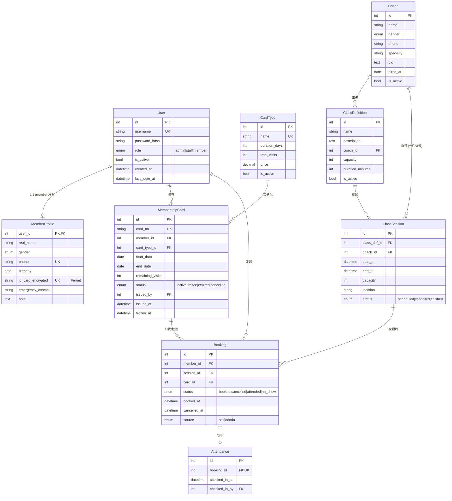

# 数据库设计

> 论文第 3 章原料。对应 `docs/设计方案.md` §4。主要引用：[4][6]。
>
> 实现位于 `backend/app/models/`，首次迁移：`backend/migrations/versions/7767fac4ee01_initial_schema_*.py`。

## 1. 概念模型（ER 图）



## 2. 关系模型与范式分析（[4]）

- 全部表满足 **3NF**：非主属性完全依赖于主键，且无传递依赖。
- 典型反例避免：
  - `MembershipCard` 不冗余 `member.real_name` 与 `card_type.price`，需要时联表取。
  - `Booking` 不直接冗余 `session.start_at`，避免排课时间修改后预约数据不一致。
- 例外：`MembershipCard.card_no` 与 `Coach.specialty`（逗号分隔的多值字段）是**有意的反范式**——`card_no` 是面向业务的对外编号，`specialty` 在本毕设范围内不需要可查询的多对多结构。

## 3. 表结构 DDL（SQLite 方言）

> 由 Alembic autogenerate 产出，详见 `migrations/versions/7767fac4ee01_initial_schema_*.py`。
> 此处给出**逻辑视图**（去掉 Alembic 包装、保留语义）。

```sql
CREATE TABLE users (
    id INTEGER PRIMARY KEY AUTOINCREMENT,
    username VARCHAR(64) NOT NULL UNIQUE,
    password_hash VARCHAR(255) NOT NULL,
    role VARCHAR(16) NOT NULL,         -- 'admin' | 'staff' | 'member'
    is_active BOOLEAN NOT NULL DEFAULT 1,
    created_at DATETIME NOT NULL,
    last_login_at DATETIME
);
CREATE INDEX ix_users_username ON users(username);

CREATE TABLE member_profiles (
    user_id INTEGER PRIMARY KEY REFERENCES users(id) ON DELETE CASCADE,
    real_name VARCHAR(64) NOT NULL,
    gender VARCHAR(8),                 -- 'male' | 'female' | 'other'
    phone VARCHAR(32) NOT NULL UNIQUE,
    birthday DATE,
    id_card_encrypted VARCHAR(255) UNIQUE,
    emergency_contact VARCHAR(64),
    note TEXT
);
CREATE INDEX ix_member_profiles_phone ON member_profiles(phone);

CREATE TABLE coaches (
    id INTEGER PRIMARY KEY AUTOINCREMENT,
    name VARCHAR(64) NOT NULL,
    gender VARCHAR(8),
    phone VARCHAR(32),
    specialty VARCHAR(255),
    bio TEXT,
    hired_at DATE,
    is_active BOOLEAN NOT NULL DEFAULT 1,
    created_at DATETIME NOT NULL
);
CREATE INDEX ix_coaches_name ON coaches(name);

CREATE TABLE card_types (
    id INTEGER PRIMARY KEY AUTOINCREMENT,
    name VARCHAR(64) NOT NULL UNIQUE,
    duration_days INTEGER,             -- 时长卡：到期日 = start_date + duration_days
    total_visits INTEGER,              -- 次卡：初始次数
    price NUMERIC(10,2) NOT NULL,
    is_active BOOLEAN NOT NULL DEFAULT 1
);

CREATE TABLE membership_cards (
    id INTEGER PRIMARY KEY AUTOINCREMENT,
    card_no VARCHAR(32) NOT NULL UNIQUE,
    member_id INTEGER NOT NULL REFERENCES users(id) ON DELETE RESTRICT,
    card_type_id INTEGER NOT NULL REFERENCES card_types(id) ON DELETE RESTRICT,
    start_date DATE NOT NULL,
    end_date DATE,
    remaining_visits INTEGER,
    status VARCHAR(16) NOT NULL,       -- 'active' | 'frozen' | 'expired' | 'cancelled'
    issued_by INTEGER REFERENCES users(id) ON DELETE SET NULL,
    issued_at DATETIME NOT NULL,
    frozen_at DATETIME
);
CREATE INDEX ix_membership_cards_card_no ON membership_cards(card_no);
CREATE INDEX ix_membership_cards_member_id ON membership_cards(member_id);

CREATE TABLE class_definitions (
    id INTEGER PRIMARY KEY AUTOINCREMENT,
    name VARCHAR(64) NOT NULL,
    description TEXT,
    coach_id INTEGER REFERENCES coaches(id) ON DELETE SET NULL,
    capacity INTEGER NOT NULL DEFAULT 10,
    duration_minutes INTEGER NOT NULL DEFAULT 60,
    is_active BOOLEAN NOT NULL DEFAULT 1
);
CREATE INDEX ix_class_definitions_name ON class_definitions(name);

CREATE TABLE class_sessions (
    id INTEGER PRIMARY KEY AUTOINCREMENT,
    class_def_id INTEGER NOT NULL REFERENCES class_definitions(id) ON DELETE CASCADE,
    coach_id INTEGER REFERENCES coaches(id) ON DELETE SET NULL,
    start_at DATETIME NOT NULL,
    end_at DATETIME NOT NULL,
    capacity INTEGER NOT NULL DEFAULT 10,
    location VARCHAR(64),
    status VARCHAR(16) NOT NULL        -- 'scheduled' | 'cancelled' | 'finished'
);
CREATE INDEX ix_class_sessions_class_def_id ON class_sessions(class_def_id);
CREATE INDEX ix_class_sessions_start_at ON class_sessions(start_at);

CREATE TABLE bookings (
    id INTEGER PRIMARY KEY AUTOINCREMENT,
    member_id INTEGER NOT NULL REFERENCES users(id) ON DELETE CASCADE,
    session_id INTEGER NOT NULL REFERENCES class_sessions(id) ON DELETE CASCADE,
    card_id INTEGER REFERENCES membership_cards(id) ON DELETE SET NULL,
    status VARCHAR(16) NOT NULL,       -- 'booked' | 'cancelled' | 'attended' | 'no_show'
    booked_at DATETIME NOT NULL,
    cancelled_at DATETIME,
    source VARCHAR(8) NOT NULL         -- 'self' | 'admin'
);
CREATE INDEX ix_bookings_member_id ON bookings(member_id);
CREATE INDEX ix_bookings_session_id ON bookings(session_id);
-- 部分唯一索引：同会员同 session 的"有效"预约只能 1 条
CREATE UNIQUE INDEX uq_bookings_member_session_active
    ON bookings(member_id, session_id)
    WHERE status != 'cancelled';

CREATE TABLE attendances (
    id INTEGER PRIMARY KEY AUTOINCREMENT,
    booking_id INTEGER NOT NULL UNIQUE REFERENCES bookings(id) ON DELETE CASCADE,
    checked_in_at DATETIME NOT NULL,
    checked_in_by INTEGER REFERENCES users(id) ON DELETE SET NULL
);
```

## 4. 索引设计

| 索引 | 目的 |
|---|---|
| `ix_users_username` | 登录查询走该索引 |
| `ix_member_profiles_phone` | 后台按手机号搜索会员 |
| `ix_membership_cards_member_id` | "我的卡"列表 |
| `ix_class_sessions_start_at` | 按时间筛选排课 |
| `ix_bookings_member_id` / `ix_bookings_session_id` | 双向查询 |
| `uq_bookings_member_session_active` | 业务唯一性 + 兼顾"取消后可重订" |

## 5. 业务约束与状态机

### 5.1 MembershipCard.status

```
       办卡
        ▼
     [active] ──冻结──▶ [frozen]
        │   ◀──解冻──── │
        │ 到期/手动作废
        ▼
   [expired]  [cancelled]
```

迁移规则：

- `active → frozen`：staff/admin 手动冻结，记录 `frozen_at`。
- `frozen → active`：解冻，清空 `frozen_at`。
- `active → expired`：定时任务或访问时按 `end_date` / `remaining_visits` 计算（服务层）。
- `active → cancelled`：管理员手动作废，不可恢复。

### 5.2 Booking.status

```
        预约
         ▼
      [booked] ──取消──▶ [cancelled]
         │
   ┌─────┴─────┐
   ▼           ▼
[attended]  [no_show]   ← 课程 finished 时按是否签到落到这两态
```

约束：

- 创建 booked 时校验：卡可用、session SCHEDULED、未满员、唯一性（部分索引）。
- `booked → cancelled`：会员侧需在开课前 ≥2h；admin 不受限。
- `attended` 由签到接口写入；`no_show` 由 session 结束时的扫描器写入。

### 5.3 ClassSession.status

```
[scheduled] ──取消──▶ [cancelled]
     │
   课程结束扫描
     ▼
 [finished]
```

`cancelled` 触发对应 `booked` 预约的级联取消（服务层处理，不依赖 DB 触发器）。

## 6. 与 MySQL 的差异说明（[6]）

| 维度 | SQLite | MySQL（论文对照） |
|---|---|---|
| 类型亲和性 | 动态弱类型，仅"亲和性"提示 | 强类型；DECIMAL/DATETIME 严格 |
| 部分索引 | 原生支持 `WHERE` 子句 | 5.x 不支持；8.0 仍无；常用触发器或唯一辅助列模拟 |
| `Enum` | 用 CHECK + VARCHAR 模拟（本项目 `native_enum=False`） | 原生 `ENUM` 类型 |
| 并发写入 | 库级锁，单写多读 | 行级锁，高并发友好 |
| 部署 | 单文件，零运维 | 需独立 server 进程、用户、备份 |
| 适用 | 本毕设单店、≤1000 会员、≤100 QPS | 多店连锁、千万级会员 |

迁移路径（论文未来工作章节素材）：把 `SQLALCHEMY_DATABASE_URI` 改为 `mysql+pymysql://...`，把部分索引改为 MySQL 兼容方案，其余 ORM 代码无需改动 —— 这是选用 SQLAlchemy 的关键收益。
